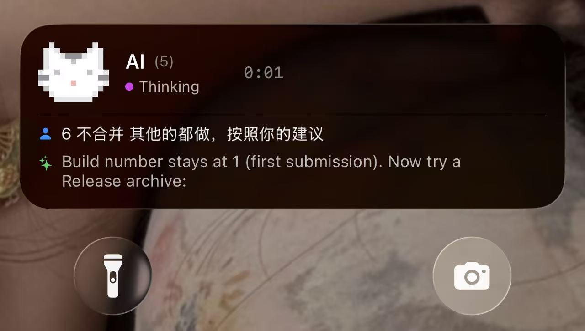
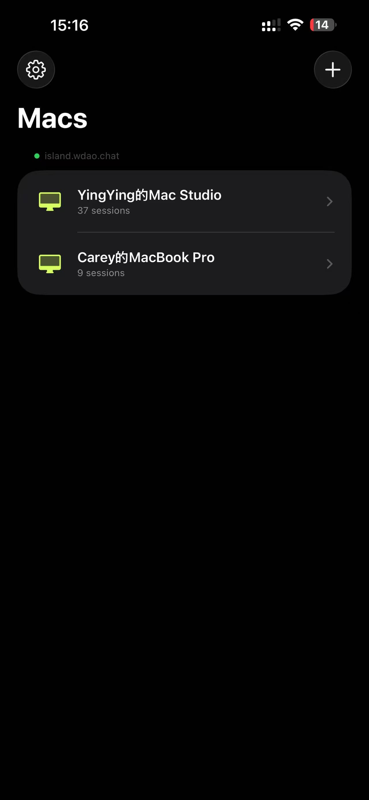
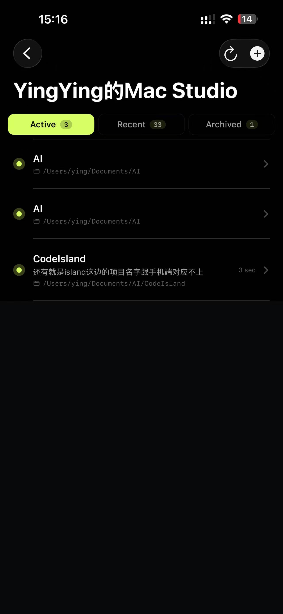
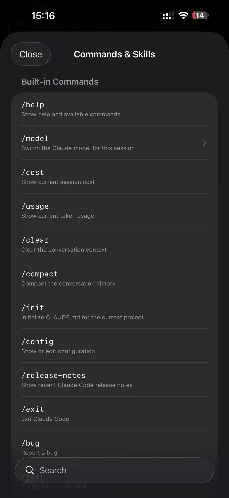
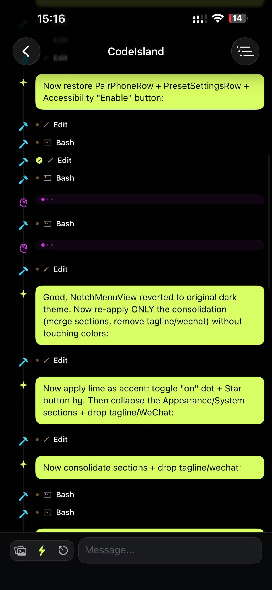
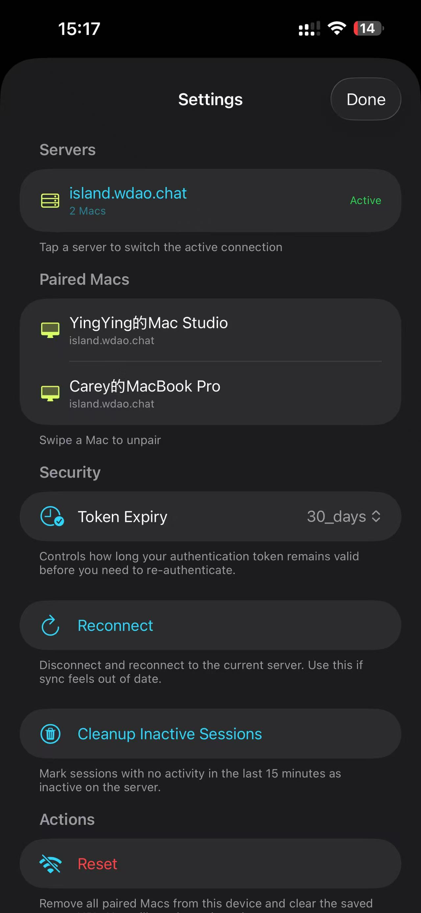

<div align="center">


# CodeIsland

**你的 AI 代理住在刘海里。**

这是一个纯粹出于个人兴趣开发的项目，**完全免费开源**，没有任何商业目的。欢迎大家试用、提 Bug、推荐给身边的同事使用，也欢迎贡献代码。一起把它做得更好！

**如果觉得好用，请点个 Star 支持一下！这是我们持续更新的最大动力。**

[](https://github.com/xmqywx/CodeIsland/stargazers)

[](https://xmqywx.github.io/CodeIsland/)
[](https://github.com/xmqywx/CodeIsland/releases)
[](https://github.com/xmqywx/CodeIsland/releases)
[](LICENSE.md)

[English](README.md) | 中文

</div>

---

<div align="center">

## 📱 即将推出：**[Code Light](https://github.com/xmqywx/CodeLight)** —— 你的 iPhone 伴侣 🐱✨

> ### *Claude 在思考，你在吃午饭。**你会知道。***



*Mac 刘海里那只像素猫，现在也住进了你 iPhone 的**灵动岛**。当前会话阶段、最近的用户提问、Claude 的回复预览 —— 直接显示在你的锁屏上。*

</div>

<table>
<tr>
<td width="20%"></td>
<td width="20%"></td>
<td width="20%"></td>
<td width="20%"></td>
<td width="20%"></td>
</tr>
<tr>
<td align="center"><b>🖥️ 一台 iPhone N 台 Mac</b><br><sub>一键切换</sub></td>
<td align="center"><b>📋 活跃·最近·归档</b><br><sub>三 tab 会话管理</sub></td>
<td align="center"><b>⚡ 任意 /斜杠命令</b><br><sub>/model · /cost · /usage…</sub></td>
<td align="center"><b>💬 实时聊天 + Markdown</b><br><sub>代码块·表格·列表</sub></td>
<td align="center"><b>⚙️ 自托管 · 完全私密</b><br><sub>零知识中继</sub></td>
</tr>
</table>

<div align="center">

### CodeIsland 下个版本会带来什么

CodeIsland 下一个版本会发布 **Code Light Sync 模块** —— 把刘海应用变成 Mac、云端、iPhone 之间的双向桥梁：

| 功能 | 对你的意义 |
|---|---|
| 🏝️ **真正的灵动岛** | ActivityKit Live Activity 实时反映"Claude 此刻在干什么"——阶段、工具名、计时 |
| 🎯 **精准终端定位** | 手机消息精确落到**你选中的那个** Claude 终端。CodeIsland 通过 `ps -Ax` 找到 `claude --session-id` 进程 → 读 `CMUX_WORKSPACE_ID` / `CMUX_SURFACE_ID` 环境变量 → `cmux send --workspace --surface`。零猜测 |
| ⚡ **斜杠命令带回显** | 在手机输入 `/model`、`/cost`、`/usage`、`/clear`。CodeIsland 给 cmux 窗格拍快照、注入命令、diff 输出，作为合成消息回传。手机上看到的就跟普通 Claude 回复一样 |
| 🚀 **远程新建会话** | 在手机上点 **+**，选一个启动预设（`claude --dangerously-skip-permissions --chrome`），选项目路径 —— CodeIsland 立刻在 Mac 上 spawn 一个新的 cmux workspace 跑那条命令 |
| 📷 **图片附件** | iPhone 相机拍照，CodeIsland 下载 blob → `NSPasteboard` + AppleScript Cmd+V 粘进 cmux 窗格 |
| 🔐 **永久 6 位配对码** | 每台 Mac 一个永久 shortCode（懒分配、永不轮转）。CodeIsland 重启—码不变；再配一台 iPhone—同一个码 |
| 🖥️ **一台 Mac 多部 iPhone · 一部 iPhone 多台 Mac** | server 端的 DeviceLink 图。一台 Mac 可以同时配对 N 部 iPhone；一部 iPhone 可以配对 M 台分布在不同后端服务器的 Mac |
| 🔄 **60 秒 echo 去重环** | 手机注入的文字不会因为 CodeIsland 的 JSONL 监听器再次检测到而被回传成重复消息 |
| 🌐 **可自托管、零知识** | 在任何 VPS 跑你自己的 CodeLight Server。中继只存加密 blob |

</div>

> **状态**：Code Light 已进入 TestFlight，App Store 提交中。
> CodeIsland 的 Sync 模块会作为下一个公开版本的一部分发布。⭐ **[给 CodeIsland 加 Star](https://github.com/xmqywx/CodeIsland)** + ⭐ **[给 Code Light 加 Star](https://github.com/xmqywx/CodeLight)** 以获得发布通知。

---

> **关键词**：Claude Code 灵动岛、MacBook 刘海监控、Claude Code 可视化、Claude Code Mac 客户端、Claude Code 监控工具、MacBook 刘海工具、AI 编程助手、Claude Code 桌面应用、Mac Dynamic Island、Claude Code 状态栏、AI coding agent monitor、macOS notch app

一款原生 macOS 应用，将你的 MacBook 刘海变成 AI 编码代理的实时控制面板。监控会话、审批权限、跳转终端、和你的 Claude Code 宠物互动 — 无需离开当前工作流。

**适用场景**：使用 Claude Code、Cursor、Windsurf 等 AI 编程工具的开发者。CodeIsland 让你在 MacBook 灵动岛（刘海）里实时查看 AI 写代码的状态，无需切换窗口。支持会话监控、代码 diff 预览、一键审批、终端跳转、Buddy 宠物、8-bit 音效、智能摘要、API 用量统计等功能。完全免费开源，支持中英双语。

## 功能特性

### 灵动岛刘海

收起状态一眼掌握全局：

- **动画宠物** — 你的 Claude Code `/buddy` 宠物渲染为 16x16 像素画，带波浪/消散/重组动画
- **状态指示点** — 颜色表示状态：
  - 🟦 青色 = 工作中
  - 🟧 琥珀色 = 等待审批
  - 🟩 绿色 = 完成 / 等待输入
  - 🟣 紫色 = 思考中
  - 🔴 红色 = 出错，或会话超过 60 秒无人处理
  - 🟠 橙色 = 会话超过 30 秒无人处理
- **项目名 + 状态** — 轮播显示任务标题、工具动态、项目名
- **会话数量** — `×3` 角标显示活跃会话数
- **像素猫模式** — 可切换显示手绘像素猫或宠物 emoji 动画

### 会话列表

展开刘海查看所有 Claude Code 会话：

- **活跃会话凸显** — 更大图标、加粗标题、状态色背景、工具动态行
- **自动识别终端** — 彩色标签显示终端类型（cmux 蓝、Ghostty 紫、iTerm 绿、Warp 琥珀等）
- **任务标题** — 显示最新用户消息或 Claude 摘要
- **运行时长** — 活跃会话用状态色显示
- **终端跳转** — 绿色按钮一键跳到对应终端
- **删除会话** — 空闲/结束的会话可一键删除
- **Subagent 追踪** — ⚡ 标签 + 可折叠的子 Agent 详情列表
- **动态面板高度** — ≤4 个会话自适应，>4 个可展开/收起

### Claude 用量监控

实时显示 Claude 使用量：

- **5h/7d 百分比** — 直接调用 Anthropic OAuth API 获取
- **进度条 + 重置时间** — 绿色 <70%，橙色 70-90%，红色 >90%
- **自动刷新** — 每 5 分钟刷新，支持手动刷新
- **零配置** — 从 macOS 钥匙串读取 OAuth Token

### 智能弹出抑制

当 Claude 会话完成时，智能判断是否弹出：

- **cmux** — 精确到 workspace 级别，正在看的 tab 不弹出
- **iTerm2** — 检测当前 session 名称
- **Ghostty** — 检测前台窗口标题
- **Terminal.app** — 检测 tab 标题
- **不抢焦点** — hover/通知弹出不会打断你在其他应用的打字

### AskUserQuestion 快捷回复

Claude 提问时，选项按钮直接显示在会话行：

- **cmux** — 点击直接发送答案（`cmux send`）
- **iTerm2** — AppleScript `write text`
- **Terminal.app** — AppleScript `do script`
- 其他终端跳转手动选择

### Claude Code 宠物集成

与 Claude Code 的 `/buddy` 伙伴系统完整集成：

- **精确属性** — 物种、稀有度、眼型、帽子、闪光状态和全部 5 项属性
- **动态盐值检测** — 支持修改过的安装（兼容 any-buddy）
- **ASCII 精灵动画** — 全部 18 种宠物物种
- **宠物卡片** — ASCII 精灵 + 属性条 + 性格描述
- **稀有度星级** — ★ 普通 到 ★★★★★ 传说

### 权限审批

直接在刘海中审批 Claude Code 的权限请求：

- **代码差异预览** — 绿色/红色行高亮
- **拒绝/允许按钮** — 带键盘快捷键提示
- **基于 Hook 协议** — 通过 Unix socket 响应

### 像素猫伙伴

手绘像素猫，6 种动画状态：

| 状态 | 表情 |
|------|------|
| 空闲 | 黑色眼睛，每 90 帧温柔眨眼 |
| 工作中 | 眼球左/中/右移动（阅读代码） |
| 需要你 | 眼睛 + 右耳抖动 |
| 思考中 | 闭眼，鼻子呼吸 |
| 出错 | 红色 X 眼 |
| 完成 | 绿色爱心眼 + 绿色调叠加 |

### 8-bit 音效系统

每个事件的芯片音乐提醒，每个声音可单独开关。

## 终端支持

| 终端 | 检测 | 跳转 | 快捷回复 | 智能抑制 |
|------|------|------|---------|---------|
| cmux | 自动 | workspace 精确跳转 | ✅ | workspace 级别 |
| iTerm2 | 自动 | AppleScript | ✅ | session 级别 |
| Ghostty | 自动 | AppleScript | - | 窗口级别 |
| Terminal.app | 自动 | 激活 | ✅ | tab 级别 |
| Warp | 自动 | 激活 | - | - |
| Kitty | 自动 | CLI | - | - |
| WezTerm | 自动 | CLI | - | - |
| VS Code | 自动 | 激活 | - | - |
| Cursor | 自动 | 激活 | - | - |
| Zed | 自动 | 激活 | - | - |

## 安装

从 [Releases](https://github.com/xmqywx/CodeIsland/releases) 下载最新 `.zip`，解压后拖到应用程序文件夹。

> **macOS 门禁提示：** 如果看到"Code Island 已损坏，无法打开"，在终端中运行：
> ```bash
> sudo xattr -rd com.apple.quarantine /Applications/Code\ Island.app
> ```

### 从源码构建

```bash
git clone https://github.com/xmqywx/CodeIsland.git
cd CodeIsland
xcodebuild -project ClaudeIsland.xcodeproj -scheme ClaudeIsland \
  -configuration Release CODE_SIGN_IDENTITY="-" \
  CODE_SIGNING_REQUIRED=NO CODE_SIGNING_ALLOWED=NO \
  DEVELOPMENT_TEAM="" build
```

### 系统要求

- macOS 14+（Sonoma）
- 带刘海的 MacBook（外接显示器使用浮动模式）

## 参与贡献

欢迎参与！方式如下：

1. **提交 Bug** — 在 [Issues](https://github.com/xmqywx/CodeIsland/issues) 中描述问题和复现步骤
2. **提交 PR** — Fork 本仓库，新建分支，修改后提交 Pull Request
3. **建议功能** — 在 Issues 中提出，标记为 `enhancement`

我会亲自 Review 并合并所有 PR。请保持改动聚焦，附上清晰的说明。

## 联系方式

- **邮箱**: xmqywx@gmail.com

  

## 致谢

基于 [Claude Island](https://github.com/farouqaldori/claude-island)（作者 farouqaldori）改造。

## 许可证

CC BY-NC 4.0 — 个人免费使用，禁止商业用途。
